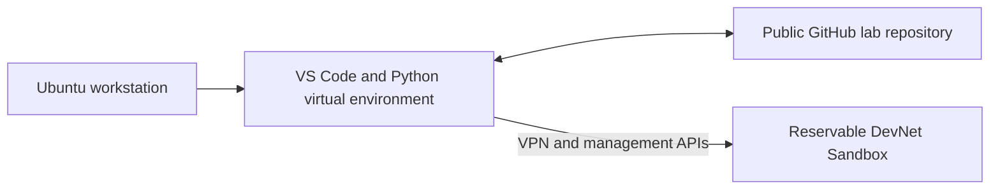

# Lab 1: Get Started

## Duration

**2 hours**

This lab prepares the Ubuntu 26.04 LTS workstation for the course. Work quickly through the guided checks; extended Git and Linux practice will occur naturally in later labs.

## Objectives

- Use essential Linux navigation, file, search, network, and help commands.
- Make a small edit with Nano or Vim.
- Install and verify Python, pip, Git, and VS Code.
- Create and use a Python virtual environment.
- Use common VS Code development features.
- Register and secure a GitHub account, then clone, pull, commit, and push.
- Identify and reserve a Cisco DevNet reservation-based sandbox.

The workstation, source-control service, editor, and sandbox form the working environment used throughout the course:



## Before you begin: Create the Lab 1 repository

Register or sign in at [github.com](https://github.com/), then create the lab repository in the browser:

1. Select the **+** menu and choose **New repository**.
2. Enter `devnet-associate-lab01` as the repository name.
3. Select **Public**.
4. Select **Add a README file**.
5. Select **Create repository**.

Do not add credentials, tokens, private keys, VPN information, `.env` files, or real customer data to a public repository.

## Part 1: Essential Linux commands

Open Terminal and run:

```bash
whoami
hostnamectl
cat /etc/os-release
pwd
mkdir -p ~/linux-practice
cd ~/linux-practice
touch router.txt
printf 'hostname: edge-r1\nmanagement_ip: 192.0.2.10\n' > router.txt
cat router.txt
cp router.txt router.backup
mv router.backup router-copy.txt
ls -la
grep -n 'management' router.txt
find . -maxdepth 1 -type f
rm router-copy.txt
```

Use `nano router.txt`, add `role: router`, save with `Ctrl+O`, and exit with `Ctrl+X`. Alternatively, use Vim: press `i`, edit, press `Esc`, then enter `:wq`.

Inspect the workstation network:

```bash
ip -brief address
ip route
getent hosts developer.cisco.com
curl -I https://developer.cisco.com/
```

Use `command --help` or `man command` before guessing options. Confirm the current directory before using `rm`.

## Part 2: Install and verify tools

```bash
sudo apt update
sudo apt install -y \
  python3 python3-pip python3-venv git curl jq nano vim openssh-client
sudo snap install code --classic
```

If Snap is unavailable, follow the official VS Code Ubuntu installation instructions.

```bash
python3 --version
python3 -m pip --version
git --version
code --version
```

Configure Git:

```bash
git config --global user.name "Your Name"
git config --global user.email "your-email@example.com"
git config --global init.defaultBranch main
git config --global core.editor "code --wait"
```

## Part 3: Virtual environment and Python check

Return to the Lab 1 repository page, select **Code**, choose **HTTPS**, and copy the displayed URL. Clone the repository before adding the supplied lab files:

```bash
cd ~
git clone https://github.com/YOUR-USERNAME/devnet-associate-lab01.git
cp -R "/path/to/Lab 01 - Get Started/." ~/devnet-associate-lab01/
cd ~/devnet-associate-lab01
python3 -m venv .venv
source .venv/bin/activate
python -m pip install --upgrade pip
python -m pip install -r requirements.txt
which python
python verify_workstation.py
python -m pip check
```

The interpreter path must contain `.venv`. Leave the environment with `deactivate`; reactivate it with `source .venv/bin/activate`.

## Part 4: VS Code essentials

```bash
code --install-extension ms-python.python
code --install-extension ms-python.vscode-pylance
code .
```

In VS Code:

1. Use Explorer to open `verify_workstation.py`.
2. Open the Command Palette with `Ctrl+Shift+P`.
3. Run **Python: Select Interpreter** and select `.venv`.
4. Open the terminal with ``Ctrl+` `` and run `python verify_workstation.py`.
5. Search the project with `Ctrl+Shift+F`.
6. Add a breakpoint beside a Python statement and press `F5` to debug.
7. Open Source Control with `Ctrl+Shift+G` to review changes.

## Part 5: GitHub account and everyday workflow

Verify the GitHub account email address, enable two-factor authentication, and store recovery codes securely. Add the completed Lab 1 files to the cloned repository:

```bash
cd ~/devnet-associate-lab01
printf '%s\n' '.venv/' '__pycache__/' '*.py[cod]' > .gitignore
git add Lab1.md requirements.txt verify_workstation.py inventory.yaml .gitignore
git diff --staged
git commit -m "Complete Lab 1 workstation setup"
git push
```

If Git requests authentication, follow the browser sign-in prompt. GitHub account passwords cannot be used for HTTPS Git operations; use the browser or credential-manager flow presented by Git and VS Code.

Practice the common workflow:

```bash
git status
git pull --ff-only
printf '\nLab 1 completed.\n' >> PROGRESS.md
git add PROGRESS.md
git commit -m "Record Lab 1 completion"
git push
```

Key meanings:

- `clone`: create a local copy of a remote repository.
- `pull`: download and integrate remote changes.
- `add`: select changes for the next commit.
- `commit`: record a local snapshot.
- `push`: publish local commits.
- Pull request: propose and review a branch before merging it.

To clone on another workstation:

```bash
git clone https://github.com/YOUR-USERNAME/devnet-associate-lab01.git
```

## Part 6: DevNet Sandbox introduction

1. Open [Cisco DevNet Sandbox](https://developer.cisco.com/sandbox/) and sign in.
2. Set the correct account time zone.
3. Compare **Always-On** and **Reserve** entries.
4. Search for a current **Catalyst Center** reservable sandbox.
5. Review its description, topology, duration, and provisioning time.
6. Reserve an instructor-approved time slot, or stop before submission if no slot is required today.

Reservation sandboxes are preferred for this course because they are private and normally provide administrative access. They commonly require a VPN and need provisioning time. Wait for the **Lab Ready** message before connecting.

For an active reservation, locate:

- Instructions and topology.
- Reservation status and provisioning output.
- VPN server and temporary credentials.
- Controller/device addresses and attributes.
- Reservation end time.

Use Cisco Secure Client instructions supplied with the reservation. OpenConnect may be used only when authorized by the instructor. Never store sandbox credentials in GitHub.

## Part 7: Final check

```bash
source ~/devnet-associate-lab01/.venv/bin/activate
python verify_workstation.py
git status
git remote -v
```

## Completion criteria

- The workstation tools report valid versions.
- The Python verification program succeeds inside `.venv`.
- VS Code uses the project interpreter and debugger.
- Lab 1 is pushed to its public GitHub repository.
- The learner can explain clone, pull, commit, push, and pull request.
- A suitable reservable DevNet sandbox has been identified.
- No credential is stored in Git or project files.

## Further references

- [Python virtual environments](https://docs.python.org/3/library/venv.html)
- [GitHub account setup](https://docs.github.com/en/get-started/onboarding/getting-started-with-your-github-account)
- [VS Code documentation](https://code.visualstudio.com/docs)
- [Cisco DevNet Sandbox getting started](https://developer.cisco.com/docs/sandbox/getting-started/)

## Key takeaways

- A Python virtual environment isolates each lab's dependencies from the operating system and other projects.
- Git records local history; GitHub stores and shares the public lab repository.
- VS Code combines editing, terminal, debugging, and source-control workflows in one interface.
- Reservable sandboxes are appropriate for configuration labs because they provide isolated resources and temporary credentials.
- Credentials, virtual environments, and generated files must remain outside source control.
